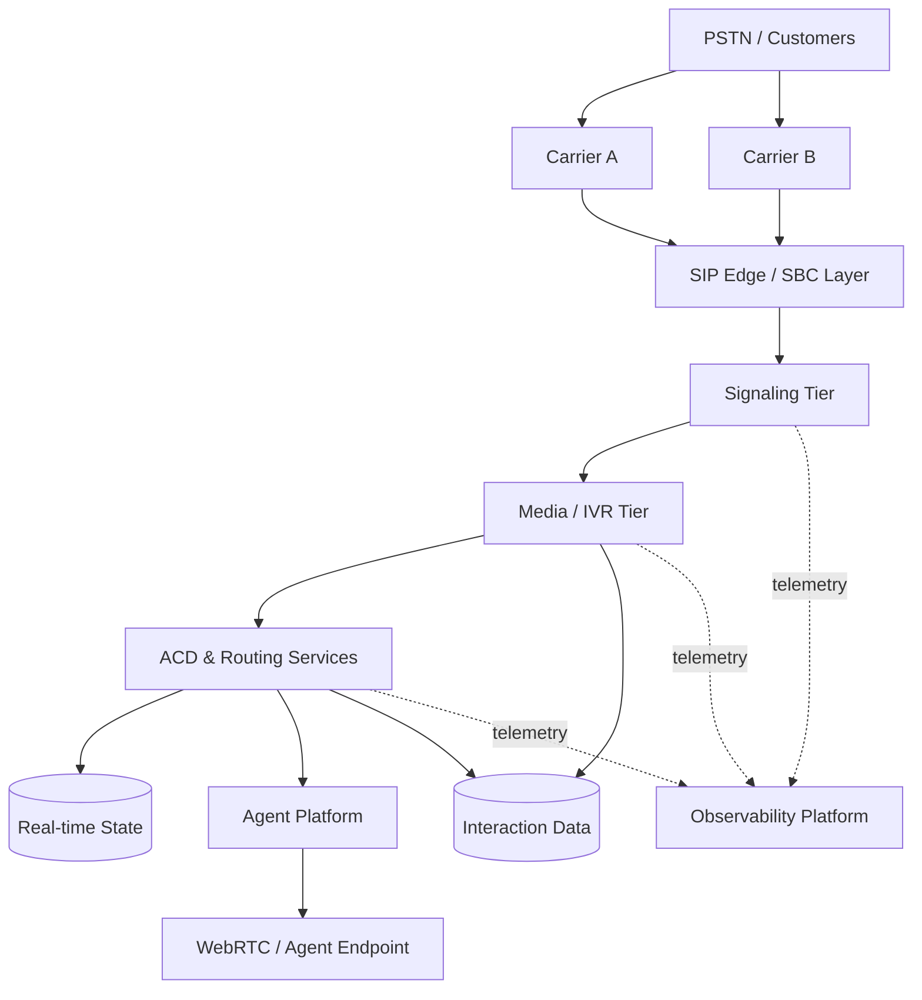

# CCaaS Reference Architecture

> A production-oriented reference architecture for modern Contact Center as a Service platforms.

## Purpose

A contact center is more than an ACD. It is a distributed real-time platform spanning carrier connectivity, signaling, media, IVR, routing, agent state, digital channels, data, integrations, observability, security, and business continuity.

This repository documents those domains as an integrated architecture and makes component ownership, state, scaling boundaries, and failure modes explicit.

## Logical architecture



## Architecture domains

| Domain | Responsibilities |
|---|---|
| Carrier & PSTN | number ingress, origination/termination, carrier diversity |
| SIP edge / SBC | trust boundary, interop, security, topology control |
| Signaling tier | SIP routing, location, policy, load distribution |
| Media tier | RTP, prompts, DTMF, conferencing, recording, transcoding |
| IVR / orchestration | self-service flows and application integration |
| ACD / routing | queues, skills, priorities, routing decisions |
| Agent state | presence, availability, capacity, concurrency |
| Agent platform | call control, desktop integration, WebRTC |
| Digital channels | chat/messaging/email interaction routing |
| Data platform | interaction records, configuration, analytics/events |
| Observability | metrics, logs, traces, SIP/media telemetry |
| Security/compliance | identity, encryption, audit, data boundaries |
| HA / DR | redundancy, failure isolation, recovery and regional continuity |

## Four-plane model

The reference architecture distinguishes:

**Signaling plane** — SIP registration, routing, dialog establishment and teardown.

**Media plane** — RTP/SRTP, prompts, recording, conferencing, transcoding and media services.

**Control plane** — ACD decisions, agent state, workflow orchestration, configuration and APIs.

**Data plane** — durable interaction data, events, reporting, analytics and audit records.

Keeping these concerns explicit helps reason about independent scaling and failure behavior.

## Repository structure

```text
.
├── README.md
├── architecture/
│   ├── logical-architecture.md
│   ├── component-model.md
│   ├── state-ownership.md
│   └── multi-region.md
├── call-flows/
├── reliability/
│   ├── failure-matrix.md
│   ├── ha-strategy.md
│   └── disaster-recovery.md
├── security/
├── observability/
├── capacity/
└── decisions/
```

## Core design questions

The documents in this repository are organized around questions such as:

- Which service owns each piece of call, queue, agent, and configuration state?
- Which components are in the signaling path versus the media path?
- How does a platform survive a carrier, node, availability-zone, or regional failure?
- What happens to established calls when control-plane services fail?
- How are retries made idempotent so a customer is not routed twice?
- How are agent state and queue state kept consistent under partial failure?
- How can signaling and media tiers scale independently?
- What telemetry is required to diagnose one interaction end-to-end?
- What data must be isolated, encrypted, retained, or excluded for compliance?

## Scope and claims

This is a **reference architecture**, not a claim that one topology is correct for every organization. Specific implementations depend on traffic profile, regulatory obligations, carrier model, cloud/on-prem constraints, recovery objectives, latency requirements, and operational maturity.

Technology-specific examples may use Kamailio, FreeSWITCH, WebRTC, Redis, PostgreSQL, Kubernetes, Prometheus, and Grafana, while the architectural concepts remain intentionally separable from individual products.

## Status

🚧 Architecture foundation under active development.
