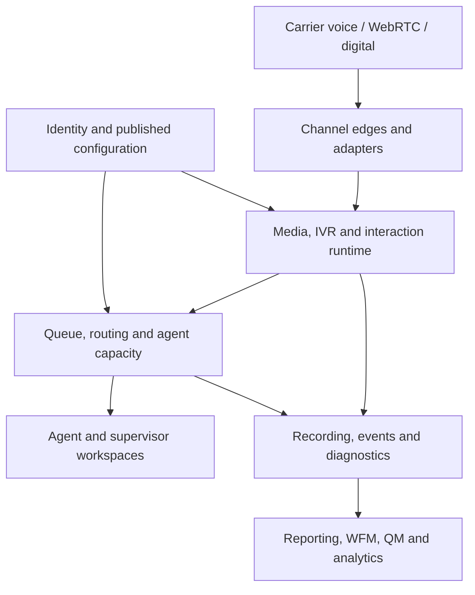

# CCaaS Reference Architecture

A production-oriented **design reference** for a multi-tenant contact-center platform: carrier voice and WebRTC, digital channels, IVR, ACD, agent and supervisor workspaces, administration, recording, transcription, quality, reporting, workforce management, outbound/callback, security, resilience and migration. It is a portfolio architecture, not deployed software or a claim of carrier-grade certification.

## Read the system in layers

1. [Capability map](architecture/capability-map.md), [coverage review](validation/coverage-review.md) and [component/service catalog](architecture/component-model.md) — product scope, gaps, logical boundaries and ownership.
2. [Interaction ownership and handoffs](architecture/interaction-ownership.md), [logical voice topology](architecture/logical-architecture.md), [programmable voice and stream adapters](architecture/programmable-voice-adapters.md), [routing policy engine](architecture/routing-policy-engine.md), [call-leg ownership](architecture/call-leg-ownership.md) and [state ownership](architecture/state-ownership.md) — creation, assignment, management, eligibility, reservations, signaling and media authority.
3. [Service contracts and endpoints](architecture/service-contracts.md) — illustrative API/event contracts, idempotency and versioning.
4. [Administration, supervisor and agent](architecture/admin-supervisor-agent.md), [digital/outbound](architecture/digital-outbound.md), [customer profile/case/journey](architecture/customer-journey-case.md), [automation/knowledge/AI](architecture/automation-ai-knowledge.md), [recording/transcription](architecture/recording-transcription-quality.md), [data/reporting/WFM](architecture/data-reporting-wfm.md), [performance/quality](architecture/performance-management.md) and [developer ecosystem](architecture/developer-platform.md).
5. [Inbound call](call-flows/inbound-voice.md), [transfer/conference/hold scenarios](call-flows/feature-scenarios.md) and [cross-channel flows](call-flows/omnichannel-and-supervisor.md).
6. [Data stores, HA and scaling](architecture/data-store-topology.md), [deployment blueprint](architecture/deployment-blueprint.md), [reliability](reliability/degradation-and-dr.md), [security/privacy](security/privacy-controls.md), [capacity](capacity/capacity-planning.md) and [observability](observability/observability-architecture.md).
7. [Build sequence](implementation/build-sequence.md), [migration strategy](migration/migration-strategy.md), [acceptance matrix](validation/architecture-acceptance.md), [routing/leg acceptance](validation/routing-and-leg-acceptance.md) and [open deployment decisions](decisions/OPEN-DECISIONS.md) — how to implement, prove and cut over.

## Architecture at a glance

```mermaid
flowchart TB
  Channels["Carrier voice / WebRTC / digital"] --> Edge["Channel edges and adapters"]
  Edge --> Runtime["Media, IVR and interaction runtime"]
  Runtime --> Control["Queue, routing and agent capacity"]
  Control --> Experience["Agent and supervisor workspaces"]
  Admin["Identity and published configuration"] --> Runtime
  Admin --> Control
  Runtime --> Evidence["Recording, events and diagnostics"]
  Control --> Evidence
  Evidence --> Insight["Reporting, WFM, QM and analytics"]
```

The four planes are **signaling**, **media**, **control** and **data/insight**. Logical service separation does not demand one microservice per box. One service owns each mutable state. An interaction carries a stable platform id across SIP Call-IDs, media legs, queue episodes, assignments and recordings. Real-time routing never depends on a reporting query; policy-required recording and audit are explicit exceptions to a broad “degrade gracefully” rule.

At intake, the **interaction service creates the canonical contact** after channel admission. The **queue owns waiting order**; the **router evaluates eligibility and ranking**; the **agent/offer authority atomically reserves capacity**; the **media or digital channel owner proves connection**; the interaction owner records the resulting assignment and terminal lifecycle. [The operational ledger](architecture/interaction-ownership.md) covers every handoff, transfer and failure. [The store matrix](architecture/data-store-topology.md) maps each authority to transactional storage, caches, event streams, analytics, HA and scaling.

## Domain index

| Concern | Detailed design |
|---|---|
| Routing/agent state | [ACD](architecture/acd-routing.md), [agent state machine](architecture/agent-state-machine.md), [state ownership](architecture/state-ownership.md) |
| Voice/carriers | [multi-carrier](architecture/multi-carrier-routing.md), [programmable voice and media streams](architecture/programmable-voice-adapters.md), [inbound flow](call-flows/inbound-voice.md) |
| Multi-region/HA | [region ownership](architecture/multi-region.md), [HA strategy](reliability/ha-strategy.md), [failure matrix](reliability/failure-matrix.md), [degradation/DR](reliability/degradation-and-dr.md) |
| Operations | [observability](observability/observability-architecture.md), [capacity](capacity/capacity-planning.md), [acceptance](validation/architecture-acceptance.md) |
| Security | [trust boundaries](security/security-boundaries.md), [privacy controls](security/privacy-controls.md) |
| Decisions | [plane separation](decisions/ADR-001-separate-signaling-media-control.md), [state/events](decisions/ADR-002-state-and-events.md), [config publication](decisions/ADR-003-configuration-publication.md), [recording policy](decisions/ADR-004-recording-policy.md) |

## Boundaries and evidence

This repository contains architecture, not an executable CCaaS. The documents distinguish **designed** from **implemented, lab-proven, load-proven, failure-proven and production-observed**. They do not assign universal SLOs, RTO/RPO, staffing levels, recording consent rules or PCI/HIPAA status. Those depend on business goals, jurisdiction, traffic profile, vendor contracts and measured tests. The [acceptance matrix](validation/architecture-acceptance.md) lists proof required before making operational claims.

Illustrative mappings may use Kamailio-class SIP routing, FreeSWITCH-class media, RTPengine-class relay, coturn-class TURN, relational durable state and an event backbone. Product choices require interoperability, licensing, security and failure testing. Contributions should state ownership, interface, idempotency, timeout, failure mode, reconciliation, telemetry, capacity and proof for any new component.

A worked [cross-channel journey](call-flows/cross-channel-journey.md) joins profile verification, case, callback, voice and survey without collapsing their state owners.
