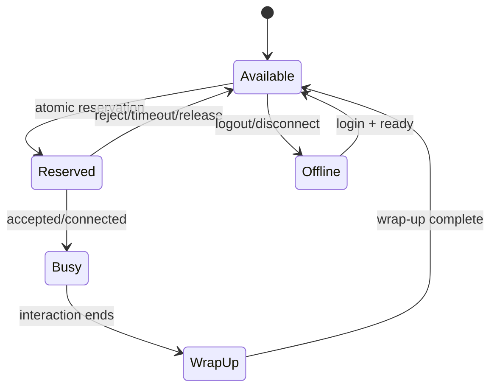

# ACD Routing Architecture

## Routing is a concurrency problem

An ACD does more than select an agent from a list. It continuously matches interactions to changing agent capacity while preserving fairness, priority, SLA policy, skill constraints, and correctness under concurrent workers and partial failures.

## Routing inputs

```text
Interaction
 ├─ channel
 ├─ queue
 ├─ priority
 ├─ required skills
 ├─ customer/context attributes
 └─ enqueue timestamp

Agent
 ├─ presence
 ├─ routing state
 ├─ skills/proficiency
 ├─ channel capacity
 ├─ current assignments
 └─ last assignment / idle timestamp
```

## Eligibility before ranking

Separate **eligibility** from **ranking**.

Eligibility answers: *Can this agent legally/operationally take this interaction?*

Typical filters include logged-in state, routable state, channel capacity, required skill membership, tenant/business boundary, queue membership, device readiness, and policy constraints.

Ranking answers: *Among eligible agents, which should be attempted first?*

Possible policies include longest idle, round robin, proficiency-weighted, least occupied, preferred agent, priority/SLA aware, and composite scoring.

## Reservation boundary

A routing worker should not assume an agent remains available between read and assignment.



A reservation should normally carry an interaction identifier, attempt identifier, owner/worker, creation time, and bounded lease/expiry semantics.

## Idempotent routing attempts

Distributed systems can lose responses after committing state. The caller may therefore retry an operation whose first execution actually succeeded.

Use a stable idempotency identity such as:

```text
interaction_id + routing_attempt_id
```

The reservation service can return the existing outcome rather than creating another reservation.

## Longest-idle nuance

A simplistic query such as "ORDER BY last_call_end LIMIT 1" is insufficient at scale because concurrent routers can select the same row and because idle time semantics must be defined.

Questions include:

- Does rejected work reset idle time?
- Does a reserved-but-not-connected attempt count?
- How does wrap-up affect idle time?
- How are agents joining a queue ranked?
- Is idle tracked per queue, channel, or globally?

## Queue priority and starvation

Strict priority can starve lower-priority interactions. Production policy may require aging or bounded priority boosts.

One conceptual model:

```text
effective_priority = base_priority + aging(wait_time)
```

The formula is policy-specific; the architectural requirement is to make starvation behavior explicit and testable.

## Routing timeout chain

Routing involves multiple time budgets:

```text
queue wait
  → router decision
  → reservation
  → agent notification
  → agent/device response
  → SIP/WebRTC setup
  → media connected
```

Each timeout needs an owner and recovery action. Otherwise multiple layers can retry independently and create duplicate work.

## Failure scenarios

The routing design must cover worker crash after reservation, agent disconnect after reservation, notification delivery failure, media setup failure after agent acceptance, stale availability, state-store latency, duplicate events, delayed events, and queue ownership failover.

## Metrics

At minimum observe routing-decision latency, reservation conflicts, offer/accept/reject/timeout rates, stale reservations, queue depth/age, agent idle distribution, routing retries, duplicate/idempotent replays, and time from reservation to media connection.
