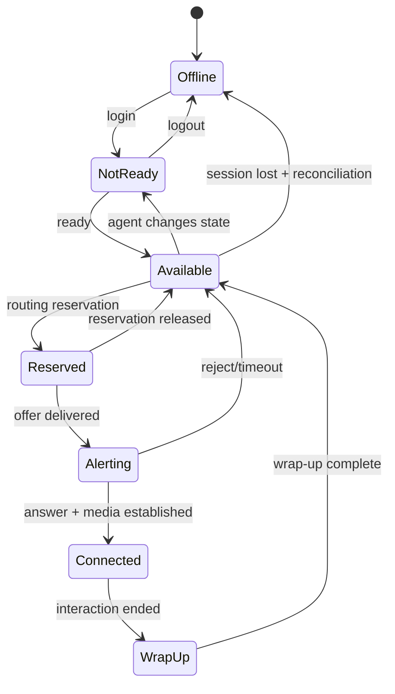

# Agent State Machine

## Why agent state needs a formal model

Agent availability is consumed concurrently by routing, desktop, telephony, workforce, supervisor, and reporting systems. A single boolean `available=true` cannot represent the operational lifecycle safely.

## Separate dimensions

A mature design distinguishes at least:

- **session presence** — logged in / disconnected;
- **routing intent** — ready, not-ready, offline;
- **reservation state** — unreserved/reserved;
- **interaction occupancy** — active assignments by channel;
- **device/media readiness** — endpoint reachable/usable;
- **wrap-up state** — post-interaction work;
- **reason code** — break, meeting, training, technical issue, etc.

These dimensions may be projected into a convenient UI state, but collapsing them in storage loses information needed for correctness and diagnosis.

## Conceptual voice state machine



## Reservation is not connected

`RESERVED`, `ALERTING`, and `CONNECTED` should not be treated as interchangeable. They have different timeout, recovery, customer, and reporting semantics.

For example, if an agent is reserved but the offer notification fails, marking the agent BUSY indefinitely creates a leaked reservation. Marking them immediately AVAILABLE without proving the previous attempt is terminated can create duplicate delivery.

## Heartbeats and leases

Desktop/WebSocket connectivity is not perfect evidence of telephony readiness. Where leases/heartbeats are used, define heartbeat interval, expiry threshold, grace behavior, reservation handling on expiry, reconnect reconciliation, and authoritative clock/ordering assumptions.

## Multi-channel capacity

Digital channels can permit concurrency while voice is commonly exclusive or tightly constrained. Represent capacity explicitly rather than deriving everything from one state:

```text
voice_capacity = 1
voice_used     = 0
chat_capacity  = 3
chat_used      = 2
```

Policy can then decide whether active chat work makes the agent ineligible for voice.

## Event ordering

Distributed events can arrive late or out of order. State updates should carry a version, sequence, logical timestamp, or other ordering mechanism sufficient for the chosen consistency model.

Example dangerous sequence:

```text
1. Agent AVAILABLE
2. Agent RESERVED
3. Agent CONNECTED

consumer receives: 1 → 3 → 2
```

A naive consumer ends with `RESERVED`, even though the agent is connected.

## Reconciliation

Recovery should compare authoritative sources after reconnect/restart. Useful questions include: Does the media platform still have an active agent leg? Does routing have an active reservation? Does the desktop have a live session? What interaction does each subsystem believe is assigned? Which state transition wins if they disagree?

The reconciliation algorithm is part of the architecture, not an operational afterthought.
