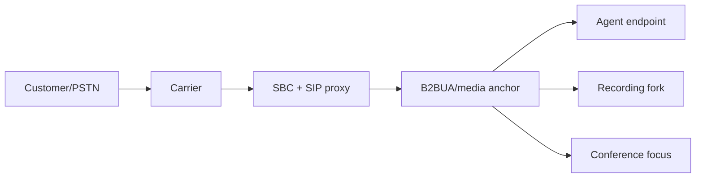

# Call legs, signaling dialogs and media ownership

An `interaction` is the customer/business journey; a `queue episode` is time in one queue; an `assignment` is an agent's work interval; a `call leg` is a signaling/media relationship. They are **not one-to-one**. A single interaction can have a carrier/customer leg, multiple IVR and agent legs, consult legs, conference participants, recording segments and transfers. A SIP B2BUA commonly creates distinct dialogs and Call-IDs on either side. Keep a stable `interaction_id` above them all.

## Reference topology and variant



**Reference choice:** the platform B2BUA/media service owns the customer/agent/consult/conference leg orchestration and normally remains media anchored. The SIP edge authenticates, normalizes and routes; it does not own the business interaction. A proxy may remain Record-Routed for in-dialog signaling but does not thereby own RTP or agent assignment. A carrier owns its PSTN-facing network and trunk leg; the platform cannot guarantee its internal state. An endpoint owns its local microphone, speakers and WebRTC peer connection; the media service owns the far-side bridge it controls.

**Alternative:** endpoint-managed SIP REFER may cause a new call directly between endpoints or through another B2BUA. That can remove the platform anchor, recording, policy or correlation. Do not enable it as a default CCaaS transfer path without proving signaling, media, recording, consent and failure semantics. SIP transfer techniques are described in [RFC 5589](https://www.rfc-editor.org/rfc/rfc5589.html), with [REFER](https://www.rfc-editor.org/rfc/rfc3515.html) and [Replaces](https://www.rfc-editor.org/rfc/rfc3891.html); a given product may implement a different control model. Conference focus/participant behavior is described in [RFC 4579](https://www.rfc-editor.org/rfc/rfc4579.html). These references do not themselves prove vendor interoperability.

## Ownership by artifact

| Artifact/state | Authoritative owner | Lifetime and recovery |
|---|---|---|
| Customer ingress SIP dialog/transaction | trunk-side UA at SBC/B2BUA boundary; proxy owns only its transaction/route state | per dialog; lost B2BUA dialog is generally not live-migratable |
| Agent SIP/WebRTC dialog | B2BUA + endpoint each own their side | independent of carrier leg; endpoint disconnect may not instantly end customer leg |
| SIP route set/registration | SIP proxy/registrar and dialog endpoints as applicable | TTL/contact flow; registration is not agent routability |
| SDP offer/answer, codec, ICE/DTLS | each negotiating endpoint; B2BUA translates separate legs | version per offer/answer; renegotiation on hold/transfer/conference |
| RTP/SRTP sockets/bridge/mix | media node/relay and remote endpoint for each side | stateful; media-node loss affects anchored sessions |
| IVR prompt/DTMF and flow state | media application + version-pinned IVR orchestrator | interaction-scoped; input event dedupe |
| Interaction and participant graph | interaction lifecycle service | durable business history, not active RTP state |
| Queue episode | queue authority | enqueue/offer/abandon/transfer episodes preserved |
| Agent assignment and capacity | agent-state/offer authority; interaction records accepted/connected intervals | reservation fence and occupancy reconciliation |
| Recording decision | recording policy/control | reevaluate for participant/jurisdiction change |
| Audio segments/manifest | media fork + recording ingest/storage | checksum, gap status, finalization |
| Transcript | transcription service | derived artifact, revision/model provenance |
| Supervisor monitoring leg | media/conference controller | privileged, audited, distinct leg |
| Billing/usage fact | metering projection from authoritative leg events | revise on late facts; no direct inference from UI |

**No single service owns “the call” in every sense.** The interaction service owns the business lifecycle, while endpoints/B2BUA own SIP dialogs, the media tier owns bridges, the offer authority owns reservations and recording owns evidence. An orchestration command coordinates them using idempotency and compensating actions; it does not make a distributed operation magically atomic.

## Identifier graph and leg record

```text
interaction_id = I-100
  queue_episode_id = Q-1, Q-2
  routing_attempt_id = R-1, R-2
  assignment_id = A-1, A-2
  customer_leg_id = L-C (carrier Call-ID C1; platform Call-ID P1)
  agent_leg_id = L-A (platform Call-ID P2; endpoint Call-ID P2)
  consult_leg_id = L-B (platform Call-ID P3)
  conference_id = F-1; participant legs L-C, L-A, L-B
  recording_id = REC-1; segments S1..Sn
```

A leg record includes `leg_id`, `interaction_id`, `parent_leg_id`/cause, role (`customer|agent|consult|supervisor|external`), direction, endpoint identities, dialog IDs/tags, media node/UUID, state/version, config/policy version, created/answered/media-connected/ended timestamps, end reason and correlation to recording segments. Distinguish `INVITE sent`, `SIP 200/ACK`, `ICE connected`, `RTP observed` and `audible audio verified`; none implies all others.

## Command ownership and sequencing

| Command | Control initiator | Signaling/media executor | State and policy check |
|---|---|---|---|
| Route to agent | router/offer authority | B2BUA creates agent leg | valid fence, agent capacity, queue episode |
| Answer/reject | agent gateway after auth | endpoint/B2BUA | current offer/leg version; late answer rejected |
| Hold/resume | agent control | B2BUA negotiates leg media direction/hold treatment | active leg, other participants, music/recording policy |
| Mute | agent endpoint (local send track) or server-side policy | endpoint/media as selected | mute is not hold; UI/server states separate |
| DTMF | agent/IVR | endpoint/media/SIP INFO or RTP event by interop | destination leg, method and audit where relevant |
| Blind transfer | agent/flow controller | B2BUA creates/replaces destination leg; REFER variant by policy | number/tenant/consent, original customer hold/continuity |
| Attended transfer | agent consult workflow | B2BUA creates consult leg, then bridges target to customer | consult connected, version, ownership handoff |
| Conference | agent/supervisor policy | media mixer/focus allocates participant legs | participant limit, consent, capacity, recording mix |
| Monitor/whisper/barge | supervisor controller | media creates privileged leg/mix policy | role, purpose, consent, audit and leg freshness |
| Hangup | customer/agent/flow/carrier | dialog endpoints/B2BUA | which leg vs whole interaction; terminal idempotency |

A control API returns `accepted/pending` until executor acknowledgment; an HTTP 200 for a command is not proof media changed. Persist command id, expected interaction/leg version, actor and timeout. If the response is lost, query by idempotency key before repeating. Media reports the actual leg transition. Then interaction, queue/agent state, recording and reporting consume events with their own completeness watermarks.

## Bridge and media principles

The customer leg may be parked on IVR/queue audio while no agent leg exists. On offer, the media service creates an agent leg and bridges only after acceptance/media readiness. For a consult, keep customer leg anchored, commonly on hold with a defined prompt/MOH; a second leg connects agent to consultant. A conference needs a mixer/focus, capacity and participant graph; merely having three SIP dialogs does not create mixed audio. Recording topology (separate tracks vs mixed) and consent follow participant changes. RTP can be anchored at SBC, B2BUA or relay according to policy; count packet paths and failure domains explicitly to avoid unplanned hairpinning or double transcoding.

## Failure ownership

- **Agent endpoint loss:** agent leg may end or suspend; customer leg can remain on media/hold for a bounded recovery, requeue or callback; release capacity only after authoritative reconciliation.
- **Media node loss:** all legs/bridges on it normally fail; another node cannot reconstruct RTP merely from database state. Mark recording partial and interaction outcome accurately.
- **SIP proxy loss:** new routing may fail while already anchored RTP may continue; in-dialog requests depend on Record-Route/topology and surviving route state.
- **Carrier loss:** customer leg may fail; agent/consult legs can be torn down by policy, avoiding orphan audio/occupancy.
- **Transfer target failure:** preserve or restore original customer-agent bridge if still alive; use bounded attempts and report unresolved state if uncertain.
- **Conference participant loss:** remove that leg; remaining bridge/mixer continues if media focus is healthy; reevaluate recording policy.
- **Control-plane outage:** established media can continue if executor is decoupled; new command/offer admission may pause. UI displays stale state rather than asserting success.

See [worked scenarios](../call-flows/feature-scenarios.md), [recording policy](recording-transcription-quality.md), [failure matrix](../reliability/failure-matrix.md) and [acceptance tests](../validation/routing-and-leg-acceptance.md).

## Independent state machines and bridge graph

| Object | Example states | Who may advance it | Does it end the interaction? |
|---|---|---|---|
| C customer leg | inviting → early → answered → media-ready → ended/failed | carrier-side UA/B2BUA observations | often yes, after terminalization/reconciliation |
| A agent leg | offered → inviting → alerting → answered → media-ready → ended/failed | agent gateway intent; B2BUA/endpoint confirmation | no; C can return to queue |
| B consult/target leg | created → alerting → answered → media-ready → ended/failed | B2BUA and target endpoint | no until bridge/ownership handoff succeeds |
| F conference focus | allocating → active → degraded → ended | media mixer/focus | depends on whether remaining bridge can be restored |
| Bridge edge C↔A / C↔B / A↔B | requested → connecting → media-verified → disconnected | media bridge controller | never infer from SIP response alone |
| I interaction | admitted → IVR/queued → assigned/connected → wrap-up/final | interaction lifecycle, informed by owners | authoritative business lifecycle |

A hold changes media direction/treatment for one or more bridge edges without destroying the SIP dialog. A transfer can replace A with B while C and I persist. A conference adds F and participant edges; leaving the mix ends one participant leg, not necessarily all legs. Record each state transition with source, version, timestamp and cause so delayed events cannot resurrect an ended bridge. Terminalization waits for a bounded reconciliation window or records an explicit unknown/partial outcome.
