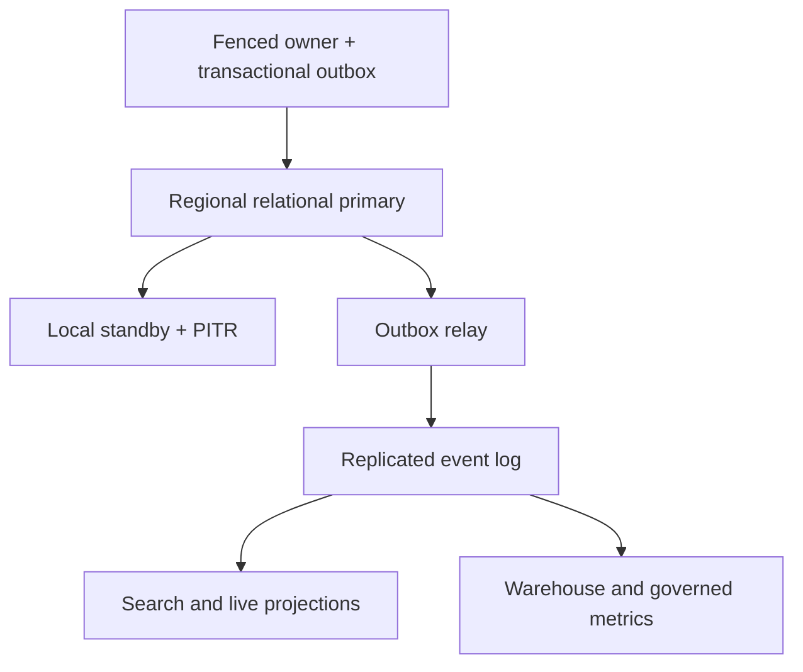

# Data stores, authority, HA and scaling

This is a **candidate physical reference stack**, not a production-validated selection. Use PostgreSQL-compatible relational clusters for durable transactional authorities, a dedicated strongly consistent lease/consensus mechanism for shard ownership, Redis-compatible caches for reconstructible low-latency reads, a Kafka-compatible durable event log, encrypted object storage for media artifacts, OpenSearch-compatible search, and a columnar analytical warehouse for reporting. Managed or self-operated equivalents require the same consistency, isolation, residency and failure proofs. Product/version, topology, cost and measured limits remain deployment decisions.

## Store mapping by owner

Each row is a logical data boundary; related rows may share a physical cluster with separate schemas, credentials, quotas and migration ownership at small scale. A reporting replica is not a second command authority. RPO/RTO targets must be set per tenant/class and measured; synchronous local redundancy does not imply zero loss across regions.

| Owner / data | Authoritative store and write pattern | Cache, stream and read model | HA, scale and loss boundary |
|---|---|---|---|
| Tenant, RBAC, directory, skills, number inventory | PostgreSQL transactional rows, constraints, versioned publication and audit outbox | immutable regional config snapshots; Redis cache with version/expiry | HA primary across zones with synchronous local standby where latency permits; partition by tenant/region; fail privileged mutation closed; replicas never publish independently |
| Identity/session and secrets | identity provider plus relational account metadata; dedicated KMS/secret manager for keys | short-lived signed tokens, revocation/session cache | provider HA and regional token-validation policy; revocation freshness budget; no secrets in general event log, DB replica or config payload |
| SIP registration/location | registrar-owned TTL bindings in replicated low-latency location store; durable account/provisioning in relational store | regional location cache, expiration events | registration is ephemeral and must be refreshed; avoid cross-region split-brain location; lost bindings require re-register and cannot imply agent availability |
| Edge/dialog and media | B2BUA in-memory live SIP/RTP state with node-local diagnostics; leg/quality events to durable outbox through control adapter | telemetry time series, searchable redacted traces | active media cannot be rebuilt from PostgreSQL; N+1 media nodes help admission, not live-call survival of a lost node; drain and measure node-loss impact |
| External voice/stream adapter | relational callback inbox, operation ledger and provider ID mapping with unique account/event key; live WebSocket/frame buffers in bounded worker memory | sanitized stream status/events, restricted diagnostics; external leg state reconciled by provider query where available | multi-zone webhook/stream gateways, per-tenant connection quotas; socket loss does not imply call loss; external live legs remain on provider infrastructure and cannot be reconstructed locally |
| IVR/flow and bot | published definitions in versioned relational config; active instance checkpoints only at recoverable boundaries | Redis optional short-lived context; outbox progress events | pin published version; node restart resumes only if channel/leg survives and flow checkpoint permits; bounded integration timeout |
| Interaction, participants, assignments | PostgreSQL shard with unique intake key, expected-version updates, state plus outbox in one transaction | stream to history/search/warehouse; cache by interaction ID only | one fenced writer per shard; zone standby and PITR; partition by tenant/region/time as workload dictates; during uncertain authority pause new mutation |
| Queue episodes and deadlines | same regional transactional consistency domain as interaction or dedicated PostgreSQL shard with unique episode key and outbox | ordered in-memory/Redis index is rebuildable, not sole membership authority | shard leader epoch and transactional dequeue; rebuild index/deadlines after failover; avoid lost or duplicate queue membership |
| Agent intent, capacity and offer leases | dedicated strongly consistent shard backed by transactional compare-and-set and monotonic fence; PostgreSQL rows or consensus KV, selected after benchmark | Redis routing snapshot rebuilt from authority; presence heartbeat TTL | linearizable reservation per capacity slot, zone quorum/standby, no dual regional writer; deny offers on quorum/epoch uncertainty; lease expiry plus media reconciliation |
| Router decisions | append-only attempt/decision records and outbox in relational shard | bounded candidate snapshot cache; restricted trace search | stateless workers scale horizontally; decision replay never silently sends another offer; writes tied to attempt/idempotency identity |
| Agent gateway and workspace | authoritative session sequence/snapshot in agent/interaction domains; gateway connection state in memory | replay stream, short-lived session cache | gateway nodes across zones; reconnect snapshot plus ordered deltas; lost gateway must not free occupied capacity |
| Digital conversation/messages | relational inbox/outbox with provider message unique key and ordered conversation sequence | object storage for attachments, search projection | partition per conversation/provider; at-least-once webhook ingestion, dedupe; provider delivery truth reconciled with receipts |
| Callback and outbound campaigns | relational promises, suppression, attempts and transactional claim/outbox | scheduler due-time index/cache, campaign analytics | lease claimed once per attempt, bounded redial after ambiguous result; consent/suppression uncertainty blocks dial |
| Customer profile, case/task, journey | relational identity-link provenance, case/SLA revisions and journey step ledger | search/customer 360 read projection; optional TTL context cache | versioned merge/split and step idempotency; regional residency and field-level access; external CRM lag explicitly labeled |
| Recording policy, manifest and transcript | relational policy result, segment manifest/checksums, transcript revision and hold metadata | encrypted object storage for audio/transcripts; restricted search index | multipart/segment ACK and reconciliation; object versioning/retention and cross-zone durability; incomplete state remains visible; key and hold policy govern deletion |
| Event journal | producer transactional outbox in each relational owner; Kafka-compatible log after outbox relay | schema registry, consumer offsets and DLQ | replicated brokers across zones, partition by tenant/aggregate key as appropriate; at-least-once, retention/replay window sized for recovery; event log alone is not source of truth |
| Reporting and metric definitions | versioned metric definitions and access policy in relational store; columnar warehouse for historical facts | stream/materialized aggregates, query cache and export object storage | independent ingest/query pools, partition by event date/tenant and bounded tenant query quotas; watermark and revision visible; warehouse outage must not stall offers |
| Live supervisor/search/history | derived streaming projection and OpenSearch-compatible index | short TTL live cache with `as_of` and source watermark | replicas across zones, rebuild from owners/log; search lag does not imply no interaction; intervention always calls authoritative command path |
| WFM, QM, surveys and performance | relational forecasts/schedules/evaluations/survey eligibility with revisions; warehouse-derived fact inputs | worker queues, scorecard/search projections | separate batch pools, provenance/data-cutoff versions, deduped survey send; no direct writes to agent capacity from WFM |
| Integrations/webhooks/developer/usage | relational app credentials references, subscriptions, delivery ledger, immutable usage facts and billing revisions | durable delivery queue/DLQ, sandbox/portal projection | per-tenant quotas/backpressure; signed webhook retry and replay; partner outage cannot consume media control thread pool |
| Audit and operational telemetry | separately protected append-only audit log/object retention; time-series metrics/log/traces with restricted payload | indexed diagnostics and sampled spans | audit durability gate for privileged action; telemetry sampling/retention, multi-zone collectors, controlled export; loss explicitly flagged |

## Replication, fencing and recovery

- **Zone failure**: Regional relational primary/standby failover is a tested operation, not a DNS promise. Fence former primary before new writes; check commit acknowledgment semantics, lost transaction window, outbox relay replay, lease epochs and client retry. Brokers, object storage endpoints and caches must also span zones with sufficient N-1 capacity. A quorum loss pauses reservations.
- **Region failure**: Asynchronous cross-region copies may lag. Do not run two writable queue/agent shards for the same tenant. Promotion requires explicit epoch/lease authority, data watermark, carrier reroute, encryption keys, pinned config and capacity validation. Interactions/recordings in the lost region may be incomplete. Document measured RPO/RTO by domain and preserve a reconciliation backlog; never assert zero loss for async replication.
- **Backups**: Encrypted full/incremental backup plus WAL/PITR for relational stores; object versioning/retention and independently protected key material; event-log retention and projection rebuild plan. Perform periodic restore to an isolated environment, verify checksum and tenant scoping, then measure restore time and missing facts. A replica is not a backup.
- **Consistency**: Interaction/queue transitions need expected versions and uniqueness; reservation requires linearizable compare-and-set plus fencing. Cross-owner workflows use durable outbox, retries, idempotency and reconciliation, not a fictional global transaction. Redis must never be the only copy of a required queue entry, consent decision or active reservation unless a separately proven durable consensus design replaces the proposed stack.
- **Scaling**: Start with measured workload budgets: CPS, concurrent dialogs, packets/sec, active queues, candidate evaluation and reservation latency, writes/sec, outbox lag, recording MB/sec, transcription concurrency, report query scans and tenant skew. Scale stateless workers independently; shard hot relational authorities by region/tenant or stable queue/agent key; preserve single-writer ownership. Add read replicas for read traffic only; isolate analytical queries and AI from control pools. Backpressure at intake/dialer before exhausting transactional or media capacity.
- **Resiliency posture**: Each request has timeout, retry budget and circuit state. If queue/lease authority is uncertain, stop new assignment and provide explicit queue/callback/failure treatment; never pick an agent from a stale cache. Reporting/search/AI may lag with disclosure. Required recording and privileged audit follow tenant policy, including fail-closed cases. Existing calls may continue through control-plane outages only where their anchored media and policy allow.

## Operational checks before product selection

Benchmark primary failover and pool reconnection under realistic CPS and reservation load; prove no double assignment after old leader recovery. Kill an outbox relay and replay without missing/duplicate business facts. Lose a zone with one media node and measure existing call loss separately from new-call admission. Restore the relational shard and object manifest together to a declared watermark; detect orphan/missing segments. Stall warehouse/search and verify routed calls continue while dashboards show lag. Simulate region promotion with stale prior owner and ensure it cannot commit. Publish measured N-1 headroom, RPO/RTO, retention, backup restore, cost and data-residency results in the deployment decision record. See [deployment blueprint](deployment-blueprint.md) and [acceptance criteria](../validation/architecture-acceptance.md).
