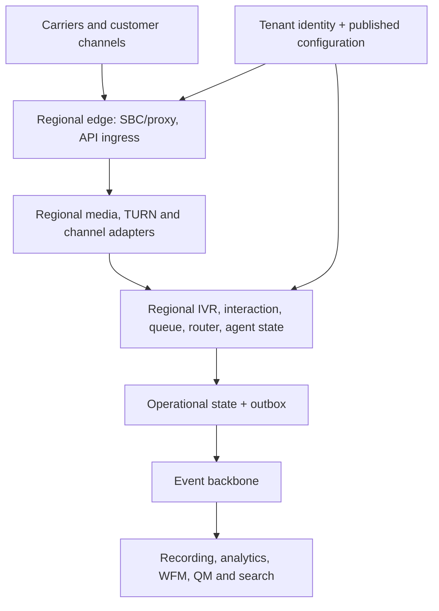

# Deployment blueprint and physical failure boundaries

This turns logical services into a candidate deployment topology. It is a **reference**, not a cloud bill of materials or measured HA claim. Product selection, sizing, network policy and RTO/RPO come from the [open decisions](../decisions/OPEN-DECISIONS.md) and [capacity tests](../capacity/capacity-planning.md).

## Placement and failure-domain matrix

| Workload | Placement and scaling unit | Surviving-node behavior | Dependency constraints |
|---|---|---|---|
| SBC/SIP proxy | independent nodes across zones, carrier-aware routing | new calls move after health withdrawal; in-dialog route topology tested | DNS, TLS certs, carrier source policy, CPS |
| B2BUA/media/recorder fork | regional media pools with explicit port/NIC/CPU/storage envelopes | active anchored calls on failed node generally drop | avoid cross-region RTP hairpin; drain for maintenance |
| TURN/WebRTC ingress | regional relay pools near endpoints/media | ICE restart may recover only if endpoints/session support it | relay credentials, egress budget, candidate privacy |
| Interaction/queue/reservation | region/shard owner with fenced authority and durable recovery | workers restart; state owner cannot split-brain | consistent lease/version store, outbox and fail-safe admission |
| Agent gateway | zone-distributed stateless sessions plus server snapshot/replay | reconnect and reconcile, not assumed call hangup | identity, sequenced events and media state |
| Config/identity | replicated published snapshots and scoped auth | last-known-good within expiry, privileged changes fail closed | immutable versions, region ACK and audit |
| Recording segments | regional encrypted object storage + manifest authority | missing segment → partial, legal hold/retention preserved | storage ACK, key access, replication lag |
| Event/analytics/search | independent ingest and query capacity | lag with watermarks; live routing isolated | replay, DLQ, privacy and schema governance |
| WFM/QM/AI/knowledge | separate compute pools with egress and budget limits | degraded suggestions/reporting, calls continue | consent, model/vendor boundary, source provenance |

## Network and data boundaries

Carrier trunks terminate at SBC, which routes SIP toward trusted proxy/B2BUA. Browser endpoints reach authenticated APIs/WSS and approved TURN/media addresses; do not expose internal reservation or datastore ports. Media packets and control APIs have separate network policies and capacity limits. Use service identity and least-privilege authorization even within one cluster. Packet capture and recording access require a separate diagnostic/regulated path. Operational stores hold current versioned state; event journal preserves facts; search/warehouse are projections; audio is stored outside the event bus. Define regional storage, replication, encryption keys and vendor egress per data class.

## Resource and release model

Benchmark CPS, dialog concurrency, RTP packets/sec, codec/transcoding, recording bandwidth, WebSocket agents, routing decisions/sec, event ingest and analytical queries independently. N-1 node/AZ or regional takeover headroom must be measured with the actual workload mix and scale-up delay. Reserve capacity for carrier failover and retry storms. Use immutable artifacts, infrastructure-as-code, contract tests, canary tenants/queues, synthetic calls and progressive rollout. Config publication and application release have separate versions and rollback. Planned media restart drains active sessions; forced loss is documented customer impact.

## Region failure and reconciliation

A new-admission controller shifts **eligible** traffic after carrier/path health and capacity checks. A failed region's established media sessions are not assumed portable. The surviving region obtains a new ownership epoch for queue/reservation shards, rejects stale writes, reconciles durable interactions and marks incomplete recordings/events. Failback is gradual, after config/key/carrier routing and data watermark convergence. Prove this in a game day with measured call impact; a green load balancer is insufficient.
