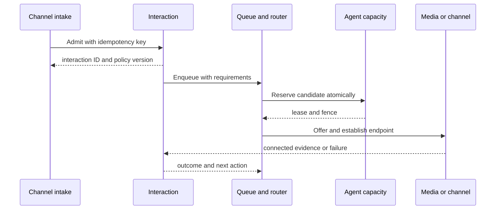

# Interaction ownership and operational handoffs

This is the normative logical boundary for a contact episode. It describes a proposed architecture, not an implemented service. A single process may host several owners, but ownership cannot be ambiguous. See [call-leg ownership](call-leg-ownership.md) for SIP/RTP details and [data placement](data-store-topology.md) for persistence.

## Identity and creation

An **interaction** is one customer contact episode, beginning at admitted intake and ending after channel termination and required disposition. A case may span many interactions; a digital conversation may contain multiple interaction episodes; a transfer usually keeps the interaction ID but creates another queue episode, assignment, and media leg. Consult legs and conferences are participants in the same interaction unless a separately admitted customer contact is created. Every identifier is tenant scoped.

| Entry | Who accepts the external stimulus | Who creates the canonical interaction | Admission rule and duplicate key |
|---|---|---|---|
| Inbound voice | SBC validates peer and number; proxy/B2BUA creates a provisional call leg | Interaction service, invoked by voice intake adapter after tenant/DID resolution | `tenant + ingress leg + carrier attempt`; reject unknown tenant/number, dedupe retransmissions; do not treat SIP Call-ID alone as globally unique |
| Inbound chat/message/email | Channel adapter validates signature/account, normalizes provider message and delivery | Interaction service after conversation policy decides new episode versus continuation | `tenant + provider + provider event/message id`; acknowledgments and retries must not create another episode |
| Scheduled callback | Callback scheduler claims due promise and asks outbound intake to originate | Interaction service on admitted attempt; retain `callback_id` and original journey/case | `tenant + callback + attempt`; claim lease and consent/window check before dialing |
| Campaign outbound | Dialer selects eligible record and asks outbound intake to originate | Interaction service on admitted attempt, before carrier leg placement | `tenant + campaign + record + attempt`; consent, pacing and suppression checks precede dial |
| Agent-created work | Authorized workspace submits task/interaction command | Interaction service after policy and tenant validation | client idempotency key plus actor and task target; no client-generated authoritative state |

If signaling arrives but interaction creation is unavailable, the edge applies a bounded admission timeout and returns an explicit failure/fallback. It cannot silently bridge a customer to an agent with no correlation or required policy. A provisional edge leg may be torn down without a canonical interaction; emit a separate admission-failure fact with a safe correlation ID. If the create response is lost, retry with the same key and query the owner before creating a new attempt.

The interaction service alone allocates `interaction_id`, pins tenant/channel/config version, holds canonical lifecycle and participant references, and commits state plus outbox. It does **not** own SIP dialogs, RTP, waiting order, agent capacity, recordings, customer master data or report aggregates. It accepts authoritative results from those owners with source versions and applies valid transitions idempotently. Terminal state is irreversible except an explicitly versioned correction event; late media facts append evidence, never resurrect the contact.

## Assignment and management sequence

1. **Qualify**: IVR/flow or digital automation collects intent and context. Profile links are provenance-labeled; the interaction owner records references and consent snapshot, not an unverified identity claim.
2. **Enqueue**: Interaction requests a queue episode with unique `(interaction_id, episode_number)`. Queue authority persists priority, SLA clock, deadline and ordered membership. It decides waiting/abandonment and owns dequeue reasons. The interaction records the queue reference and lifecycle transition.
3. **Select**: Router reads a versioned, freshness-bounded candidate snapshot, applies hard eligibility then rank/overflow policy, and records policy version and exclusion trace. The router proposes an offer; it cannot declare an agent busy.
4. **Reserve**: Agent-capacity/offer authority atomically checks readiness, channel mix, current assignments and version, then writes a lease/fencing token. This is the serialization point against double assignment. No offer is delivered without a valid reservation. Queue authority marks the episode offered but preserves recoverable membership until the defined dequeue event.
5. **Deliver**: Agent gateway sends offer with attempt/lease expiry and sequence. Accept/reject is an authenticated command to the offer authority. A disconnected workspace is not an accept; late acceptance with stale fence fails.
6. **Connect**: Call control instructs B2BUA/endpoint or digital adapter. Only a media/channel-connected fact establishes the handled assignment; agent acceptance alone is not a connected call. Interaction service records participant/assignment transitions; queue closes the episode with a reason; agent state converts reserved capacity to occupied. If setup fails, release lease and requeue/overflow according to pinned policy.
7. **Control**: Agent commands pass gateway authorization and interaction preconditions to the channel-specific call-control owner. Media owns hold/mute/bridge/DTMF/leg result; interaction owns participant and assignment meaning; supervisor intervention follows separate RBAC, consent and audit. Transfer may open a new queue episode and reservation while existing legs continue. Conference adds legs/bridge membership. Never infer leg state from UI clicks.
8. **End and wrap**: Channel owner reports termination. Interaction closes channel activity, asks for required disposition and records the outcome; agent state enters wrap-up per policy and then frees capacity. Queue and reservation reconcile outstanding attempts. Recording finalization/transcription and reporting continue asynchronously. A timed-out wrap-up follows explicit tenant policy and retains a missing-disposition reason.

## Boundary ledger

| Owner | Commands accepted / authoritative writes | Emits / reads | Must never do | Failure and recovery boundary |
|---|---|---|---|---|
| Carrier/SBC/number service | peer admission, trunk/number binding, route health | SIP admission and route outcome; published DID/config | create a handled assignment or alter tenant ownership from SIP header | withdraw unhealthy ingress; existing dialogs depend on topology; reconcile edge admission failures |
| Proxy/registrar | transport routing and endpoint registration/location TTL | contact reachability and SIP diagnostics | treat registration as agent ready or authoritative customer identity | expire stale contacts; new setup fails/alternate route, preserve observable cause |
| B2BUA/media/TURN | legs, bridges, RTP/ICE, prompts, DTMF and actual media state | leg/quality/connection facts; pinned call-control commands | route by reading warehouse or assign agent capacity | active anchored calls may fail on node loss; reconcile orphan legs and interaction outcome |
| Digital adapter/conversation | provider delivery, receipts, message ordering and channel state | message facts and conversation reference | duplicate interaction on webhook retry or claim delivery from send request | inbox dedupe, retry budget, DLQ and delivery-status reconciliation |
| IVR/flow/bot | version-pinned flow instance, input and bounded tool invocation | intent/requirements, escalation/fallback | write queue membership or agent state | timeout to approved fallback; preserve entered context and trace |
| Interaction lifecycle | canonical contact ID, lifecycle, participants, assignment references and terminal outcome | intake/owner results; interaction events | mutate SIP dialog, reservation, case master, recording blob or report metric | shard leader fenced; durable outbox; reconcile pending transitions with channel/queue/agent owners |
| Queue | queue episode, wait clock, priority/aging, abandonment and dequeue reason | router requests and queue events | assign agent merely by removing queue item | durable episode plus fenced shard; replay and reschedule deadlines after restart |
| Router | policy evaluation, candidate ranking, attempt/decision trace and fallback choice | queue/agent snapshots; offer proposal | assert busy/connected or bypass reservation | retry with fresh snapshot on conflict; bounded fallback if dependency unavailable |
| Agent state and offer | ready intent, observed presence, device readiness, concurrency, lease/fence, occupied/wrap-up | offer outcomes and capacity events | infer connected media from button click | fail closed on stale capacity; recover reservations by fence and media reconciliation |
| Agent gateway/workspace | authenticated session delivery, ordered UI events and command forwarding | server snapshot/replay and acknowledgments | act as state authority or silently replay ambiguous command | reconnect snapshot then deltas; preserve active calls on transient UI loss |
| Callback/dialer | promise/campaign attempts, consent/window/pacing state | admitted outbound attempt and result | originate duplicate calls on uncertain carrier result | idempotent claims; query result before redial; stop on uncertain compliance state |
| Profile/case/journey | identity link provenance, case/task/SLA, cross-contact step ledger | linked IDs and triggers | overwrite interaction history or change routing lease | stale context labeled; journey retries deduped; case survives channel loss |
| Recording/transcription | policy outcome, segment manifest, retention/hold, transcript revisions | media forks/ACKs and completion/failure events | mark recording complete from call-ended alone | partial/missing declared; protected storage, repair and legal retention |
| Supervisor/QM/WFM | authorized intervention command, evaluations, forecast/schedule/adherence | governed facts and current snapshots | edit historic interaction or bypass media policy | stale views marked; privileged operations fail closed on audit/authorization loss |
| Reporting/search | metric definitions, projections, indexes, exports and watermarks | owner outbox events, immutable revisions | feed a routing decision with warehouse-derived current capacity | replay/rebuild; isolate query load; disclose lag and corrections |
| Admin/config/identity/audit | tenant/role/skill/queue/policy publication, identity, audit evidence | immutable signed/configured versions to runtime | mutate active interaction's pinned version in place | last-known-good within expiry for permitted actions; sensitive changes fail closed |
| Integration/developer/metering | scoped API delivery, external sync provenance, immutable usage facts | outbox/webhooks and reconciled consumption | synchronously block media on partner webhook or treat billing as call authority | retries/DLQ/rate limits; quarantine uncertain external data |

## Ownership under transfers, concurrency and crashes

| Event | Interaction | Queue/router | Agent/offer | Media/channel | Reporting |
|---|---|---|---|---|---|
| Blind transfer to queue | same ID, new assignment/participant phase | new queue episode and routing attempt | release old after leg policy; reserve new agent | transfer/bridge outcome and old/new leg evidence | separate queue and handling intervals |
| Attended consult then complete | same ID, consult participant and transition | no new queue unless policy sends to queue | source remains occupied; target reserved separately | consult bridge, customer hold, completion or rollback | consult time and both assignments attributed by policy |
| Conference | same ID, multiple participants | no implicit requeue | each participating agent consumes defined capacity | bridge membership and media quality per leg | participant intervals, not duplicate offered interaction |
| Customer abandons while offered | terminal/abandoned only after channel evidence | queue episode closes with abandon | revoke fence; late accept rejected | hangup leg fact | offered/abandon definitions follow episode policy |
| Agent UI disconnects during call | interaction remains active | no requeue based on socket loss | readiness may change for new work, occupied lease remains | active media continues if healthy | continuity and UI interruption recorded separately |
| Router/owner loses response | query by idempotency key/version before retry | same attempt key, fence and epoch | old fence rejected after expiry/failover | ambiguous setup queried before another leg | duplicate facts deduped by event ID/version |

## Contract and proof requirements

Every cross-owner command carries tenant, interaction, episode/attempt where relevant, pinned config version, causation, idempotency key, deadline and expected version/fence. Cross-service writes are not one distributed transaction: each owner commits local state plus outbox, consumers dedupe and reconcile. Keep per-aggregate order, not global order. A command timeout means **unknown outcome**, not failure; query its status before a different attempt. Define a compensating action for each partial transition (failed offer, failed media connect, expired reservation, orphan leg, missing recording ACK).

An implementation gate should exercise duplicate webhooks/SIP retransmits, concurrent router workers, accept after expiry, transfer while customer hangs up, UI disconnect, node and zone loss, stale region owner, delayed/out-of-order media facts, event replay and warehouse lag. Assert one interaction per admitted attempt, at most one winning reservation per capacity slot, no false connected assignment and explicit terminal/partial evidence. The [validation matrix](../validation/routing-and-leg-acceptance.md) covers related routing/media scenarios.
