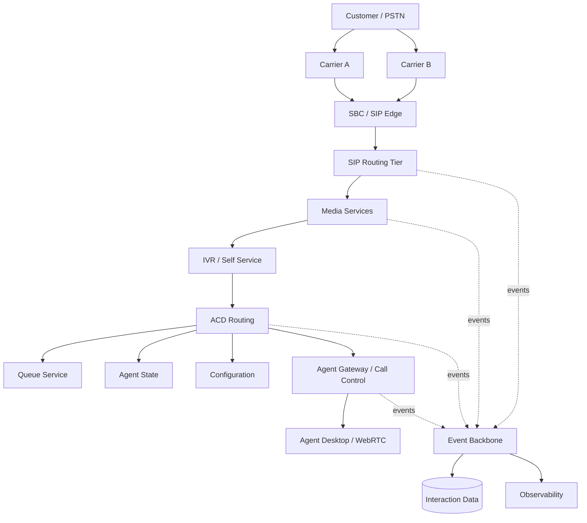

# Logical CCaaS Architecture

## End-to-end model



## 1. Carrier connectivity

A resilient ingress strategy avoids treating a carrier as an invisible dependency. The architecture should model:

- DID ownership and porting constraints;
- inbound routing policy;
- carrier-specific SIP interop;
- capacity/CPS limits;
- failure detection;
- alternate carrier routing;
- emergency and regulatory constraints where applicable.

Carrier diversity is useful only when failures are sufficiently independent and traffic can actually move between paths.

## 2. SBC / SIP edge

The edge forms a trust and interoperability boundary. Depending on implementation, responsibilities can include:

- source authentication and trust policy;
- topology hiding;
- SIP normalization/interworking;
- rate and abuse controls;
- TLS/SRTP termination;
- NAT handling;
- admission control;
- carrier policy;
- media anchoring where required.

SBC and SIP-proxy responsibilities should not be conflated automatically; actual ownership depends on the selected topology.

## 3. SIP routing tier

The signaling tier determines where new SIP requests should be delivered. A Kamailio-class proxy can provide high-throughput routing, dispatcher/load-balancing logic, location services, policy, and health-aware destination selection.

The design should explicitly decide whether the signaling tier is dialog-aware and whether it must remain Record-Routed for subsequent in-dialog requests.

## 4. Media services

A FreeSWITCH-class media tier can provide:

- RTP anchoring;
- prompts and announcements;
- DTMF handling;
- conferencing;
- recording control;
- transcoding where unavoidable;
- media applications;
- bridging customer and agent legs.

Media is resource-intensive compared with SIP proxying. Signaling and media capacity should therefore be modeled independently.

## 5. IVR and orchestration

IVR is an application orchestration domain rather than merely prompt playback. It may invoke identity, CRM, payment, order, scheduling, AI, and other services.

External dependencies need bounded timeouts, retries appropriate to operation semantics, circuit breaking/degradation behavior, and customer-safe fallback paths.

## 6. ACD routing

The routing domain consumes interaction requirements plus queue, skill, priority, agent, capacity, and policy state to produce a routing decision.

A simplified decision model is:

```text
Interaction
  + Queue Policy
  + Required Skills
  + Priority / SLA
  + Eligible Agents
  + Current Capacity
  + Routing Strategy
  = Reservation / Routing Decision
```

Routing must handle concurrency explicitly; reading `AVAILABLE` and later writing `BUSY` without an atomic reservation boundary can double-assign an agent.

## 7. Agent connectivity

The agent platform separates browser/desktop concerns from core routing. Responsibilities can include authentication, presence, WebSocket/event delivery, call-control APIs, WebRTC signaling, device state, CRM integration, and supervisor features.

## 8. Event and data architecture

Real-time call processing should not synchronously depend on every downstream reporting/analytics system. Events can decouple operational call processing from durable interaction history, analytics, workforce systems, and observability.

This does not eliminate consistency requirements; event schemas, ordering, idempotency, replay, retention, and correlation must be designed explicitly.

## 9. Observability

A useful observability model correlates one interaction across:

```text
Carrier Call ID
      ↓
SIP Call-ID / dialog
      ↓
Media UUID
      ↓
Interaction ID
      ↓
Queue / Routing ID
      ↓
Agent Session ID
```

The exact identifiers differ by implementation, but an explicit correlation strategy is essential for troubleshooting distributed call flows.
