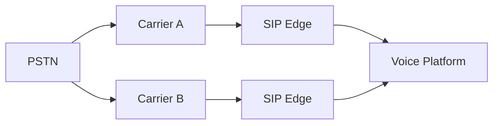

# Multi-Carrier Voice Routing

## Objective

Carrier redundancy should provide a controllable routing capability, not merely two configured trunks. The platform needs explicit policy for health, capacity, number reachability, failover, restoration, and observability.

## Inbound model



The actual ability to fail inbound traffic between carriers depends on number ownership, routing/porting model, carrier capabilities, regulatory constraints, and provisioning. The architecture must not assume that configuring a second SIP trunk automatically makes every DID reachable through it.

## Outbound selection

A conceptual policy can filter and rank routes using destination eligibility, regulatory/emergency requirements, carrier health, trunk capacity, CPS/concurrency headroom, cost policy, quality, and tenant/business policy.

Health should be one input to eligibility—not the only input.

## Health model

Avoid a single boolean derived from ICMP or TCP. Carrier path health can incorporate SIP OPTIONS where supported, synthetic call completion, real call response distribution, post-dial delay, media establishment, RTP quality, carrier alarms, and capacity/rejection signals.

A path that answers OPTIONS but returns 503 for production INVITEs is not healthy for the customer capability that matters.

## Circuit-breaker concept

```text
CLOSED / ELIGIBLE
   ↓ error threshold
OPEN / WITHDRAWN
   ↓ cooldown + probes
HALF-OPEN
   ↓ successful validation
CLOSED
```

Thresholds require hysteresis to avoid route flapping.

## Failure classification

Do not fail over blindly on every SIP response. Some responses describe destination/user state rather than carrier-path failure. Routing policy should classify which outcomes indicate retryable infrastructure failure versus terminal or business-semantic outcomes.

## Retry amplification

If a carrier already retries downstream and the SIP edge also retries multiple media nodes while the ACD retries the interaction, one customer attempt can fan out unexpectedly. Define a total attempt/time budget and clear retry ownership.

## Restoration

Recovery is not simply "probe succeeded once → send 100% traffic." A safer restoration strategy can require sustained health, then gradual traffic reintroduction, observation, and full eligibility after stability.

## Observability

Track per carrier/path: INVITE attempts, response-code distribution, answer/seizure metrics where meaningful, setup latency/post-dial delay, concurrent sessions, CPS, transport errors, RTP/media quality, failover events, circuit state, and route-selection reason.

Every call should record the selected carrier/path and why it was selected so routing decisions can be reconstructed during incidents.
