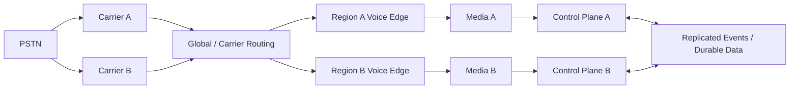
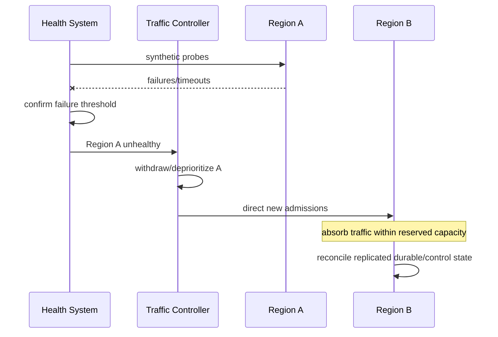

# Multi-Region Architecture

## Objective

Multi-region design is not simply deploying the same stack twice. The architecture must define traffic ownership, state locality, failure detection, data replication, capacity reserve, and what happens to sessions that are already anchored in a failed region.

## Design principles

### Keep media regional

RTP is latency-sensitive and stateful. A call admitted into Region A should normally keep its media path in Region A. Cross-region media hairpinning should be an explicit exception rather than an accidental consequence of shared services.

### Separate admission continuity from session continuity

If Region A disappears, Region B may accept new calls after traffic is redirected. That does not mean calls whose RTP and B2BUA state lived in Region A can be transparently reconstructed.

### Define state by replication requirement

Not every state deserves synchronous cross-region replication.

| State | Typical strategy |
|---|---|
| SIP transaction state | local / ephemeral |
| Active RTP session | local to media node |
| Agent presence/capacity | region-aware near-real-time state |
| Queue/routing reservation | correctness-sensitive; explicit ownership |
| Configuration | replicated/versioned |
| Interaction events | durable replication/event stream |
| Reporting/analytics | asynchronous replication acceptable in many designs |

### Capacity for failure mode

A second region is not a DR solution if it cannot absorb the intended failover traffic. Capacity targets should state whether the design supports 50/50 active-active, N+1 regional headroom, partial-service DR, or full regional takeover.

## Regional failure sequence

Failover thresholds must avoid both slow detection and route flapping. Recovery/failback should normally be more conservative than initial failure detection.

## Split-brain risk

A partition can leave both regions healthy locally while unable to coordinate. Correctness-sensitive state such as agent reservation or queue ownership therefore needs a defined partition policy. "Both regions keep routing" is unsafe unless ownership and conflict resolution have been designed for it.

## RTO and RPO

Recovery objectives should be stated per capability rather than as one platform-wide number. Voice admission, configuration, reporting, recordings, audit data, and historical analytics can have materially different recovery requirements.

## Validation scenarios

A mature implementation should test carrier withdrawal, regional SIP-edge loss, media-tier loss, control-plane partition, event replication lag, database promotion, stale agent state, capacity saturation during failover, and controlled failback.
