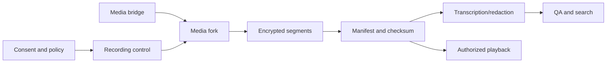

# Recording, transcription and quality architecture

Recording is a policy-controlled evidence pipeline, not a boolean on a call. A transcript is a derived artifact with its own consent, accuracy, redaction and lifecycle. Neither pipeline may silently claim success when media segments are missing.

## Recording control

Evaluate tenant, jurisdiction/participant location, channel, queue, customer/agent consent, purpose, retention, payment flow and legal hold before starting. Where law/policy requires announcement, record prompt/consent evidence and effective version. Policy returns `required`, `optional`, `prohibited` or `unknown` with explicit behavior; an unknown required-policy result is not silently treated as optional. On consult/transfer/conference, reevaluate participants and segment topology. Supervisor monitoring has a separate authorization/consent decision.

Pause/resume is a versioned command acknowledged by the media fork with timestamp and segment boundary; UI request alone does not prove media ceased. Payment collection should isolate sensitive entry and prevent prohibited sensitive authentication data from persisting in audio, screen, transcript, debug logs or backups. PCI SSC explains that card validation values in digital audio after authorization are prohibited even if encrypted: [PCI SSC FAQ 1210](https://www.pcisecuritystandards.org/faqs/1210/). Exact policy and applicability require compliance review.

## Ingest and storage

The media node emits bounded segments with `interaction_id`, `leg_id`, `recording_id`, sequence, monotonic offset, codec, key reference and checksum. Storage acknowledges durable receipt; a manifest closes only when expected segments, gaps and policy status are reconciled. Encrypt in transit and at rest with tenant/key separation, rotate keys, restrict signed playback grants, log every access, and enforce retention/deletion/legal hold over originals, derived transcripts, search indexes, replicas and backups according to policy. Avoid putting raw audio on the general event bus.

State: `requested → starting → recording ↔ paused → finalizing → complete|partial|failed|prohibited`. A partial artifact is visible as partial. If mandatory recording fails, the tenant policy chooses a tested behavior such as block/redirect/terminate or explicit degraded handling; the platform must not silently continue and label the call recorded.

## Transcription and AI enrichment

Consume only eligible, durable audio with consent and data-boundary policy. Jobs carry model/version, language, source segment offsets, speaker diarization confidence, redaction version and processing region. Streaming partials are provisional; final transcript revisions preserve provenance. ASR confidence is not legal accuracy. Human correction produces a new revision, not an overwrite of evidence. Redact sensitive data before general search/analytics; use a separate restricted original only if permitted. Guard external model egress, prompt injection from spoken content, retention and vendor contracts. Failure leaves recording metadata intact and transcript `failed|partial`, with bounded retry/DLQ.

## Quality management

Sampling rules are versioned by queue/channel/agent/time and exclude prohibited recordings. Evaluation references recording/transcript version, rubric version, evaluator, evidence span, score and dispute status. Coaching and appeal workflows retain change history. AI suggestions remain recommendations with calibrated error monitoring and human review; avoid using an unvalidated model output as authoritative agent performance or compliance evidence.

## Acceptance evidence

Test consent denied, consent withdrawn, mandatory recorder failure, pause/resume under packet loss, consult/transfer/conference leg changes, storage failure mid-call, missing segment, duplicate segment, retention expiry, legal hold, transcript revision, redaction, playback revocation and export audit. Verify audio content and gap duration against media-side counters; an API 200 is insufficient.
