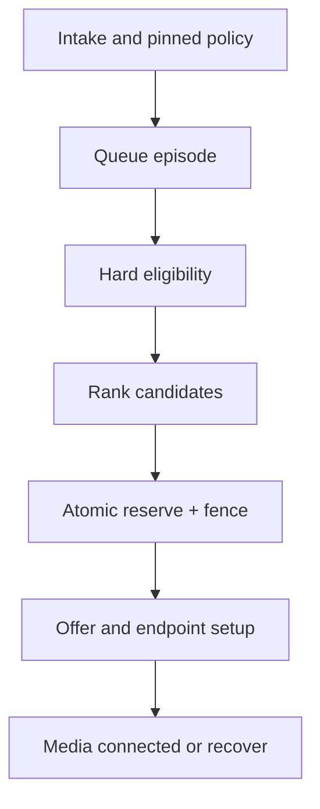

# Routing policy engine: eligibility, ranking, reservation and proof

This expands the [ACD overview](acd-routing.md) into a policy contract. The router operates on an `interaction_id` and a version-pinned policy. It returns an **offer attempt with an atomic capacity reservation**, not merely an agent id. Queue ownership, agent capacity and offer leases remain separate authoritative domains as defined in [state ownership](state-ownership.md).

## Routing families and when they apply

| Family | Decision input / example | Required guard | Typical use |
|---|---|---|---|
| Direct/DID/extension | called number, tenant, explicit agent/queue | ownership, schedule, destination validity | known destination or VIP line |
| IVR/intent | menu, DTMF, ASR intent, verified customer context | confidence/fallback, consent and PII policy | billing vs technical support |
| Queue/priority | queue, SLA class, enqueue time, promised callback window | bounded priority aging and starvation check | service tiers |
| Skills-based | required skill set, language, certification | hard skill vs preferred skill separation; expiration | specialist routing |
| Proficiency-weighted | skill level 0–N and task difficulty | calibrated scale, minimum threshold, fairness | complex cases to experienced agents |
| Attribute-based | product, region, language, customer segment, case type | attribute provenance, freshness, tenant boundary | contextual match |
| Capacity/occupancy | voice exclusivity, chat concurrency, active work | atomic reservation, channel mixing policy | omnichannel assignments |
| Longest idle / round robin | eligible agents and idle ledger | definition of idle and tie-breaking | equitable general queues |
| Least occupied / load balance | active assignments, AHT estimate, utilization | prevent stale counts, protect voice readiness | mixed digital work |
| Preferred/sticky agent | previous owner, account team, relationship | availability, consent, timeout then fallback | continuity |
| Geographic/sovereignty | locale, site, data region, business hours | jurisdiction and residency hard constraints | regulated/regional teams |
| Follow-the-sun/overflow | calendar, wait threshold, queue health | target skills/consent, explicit queue-episode accounting | off-hours/surge |
| Predictive/AI recommendation | model score, inferred intent | explainability, confidence floor, shadow evaluation, hard-constraint dominance | ranking only after eligibility |
| External decision | CRM/partner policy response | bounded timeout, signed context, fallback version | bespoke enterprise rules |
| Outbound/callback | campaign segment, time window, agent reservation | consent, quiet hours, pacing and dedupe | scheduled customer contact |
| Digital affinity | conversation owner, language, channel capacity | reopen/ownership lease and provider delivery state | chat/email continuity |

**Hard constraints** (tenant, authorization, licensing, consent, required skills, channel/device readiness, current lease and legally required region) cannot be traded for a higher score. **Soft preferences** (proficiency, continuity, idle, cost) rank candidates only after eligibility. A model never overrides a hard guard.

## Policy schema and evaluation stages

A published policy snapshot contains tenant/queue/channel scope, version/hash, schedule and holiday calendars, required/preferred attributes, skill taxonomy version, proficiency thresholds, strategy weights, timeout budgets, fallback/overflow graph, capacity rule, fairness guard and recording/data boundary. Every interaction pins its evaluation version. Validate references, cycles, unreachable fallback, starvation and unsafe cross-tenant/region edges before publication.

1. **Normalize and authenticate intake.** Establish tenant, channel, customer/context confidence, called number and source. Reject unowned numbers or unsupported channel.
2. **Resolve initial route.** Evaluate DID/extension, IVR outcome, campaign/callback promise or digital conversation. Record each rule id and decision version.
3. **Queue episode.** Persist `queue_entry_id`, priority, enqueue time and SLA clock. A transfer/requeue starts a new episode while preserving the interaction id and prior wait history.
4. **Candidate snapshot.** Read agent intent, presence, queue membership, skills/proficiency, attributes, schedule, device readiness, channel capacity, active reservations and policy revision. Capture freshness/version.
5. **Hard eligibility.** Exclude with **reason codes** (`WRONG_TENANT`, `MISSING_SKILL`, `PROFICIENCY_BELOW_MIN`, `CAPACITY_FULL`, `NOT_READY`, `DEVICE_UNREACHABLE`, `OUTSIDE_REGION`, `SCHEDULE_INELIGIBLE`, `STALE_STATE`, etc.). Unknown mandatory attribute fails eligibility or follows an explicitly approved fallback; it never silently becomes a match.
6. **Ranking.** Score only eligible agents using policy-specific weights; deterministic tie-breaker (`stable_agent_id` after rank/idle) enables replay. Keep the full scored top candidates in a privacy-controlled decision trace.
7. **Atomic reservation.** Compare agent state version/capacity, then commit one lease with `interaction_id`, `attempt_id`, `agent_id`, policy version, expiry and fencing token. On conflict, retry within the overall budget with a fresh candidate snapshot.
8. **Offer and outcome.** Agent gateway acknowledges delivery and agent accept/reject. Media/endpoint creates an agent leg. `accepted` is not `connected`; only authoritative media/connect evidence commits a handled assignment. Expiry/reject/failure releases the lease and selects the next action.
9. **Terminalization.** On connected call end, update interaction, agent occupancy/wrap-up, queue episode, reporting events and reservation exactly once; reconcile late/duplicate events.

## Skill, proficiency and attribute semantics

| Input | Authoritative source | Representation and expiry | Routing rule |
|---|---|---|---|
| Skill taxonomy | admin/config publication | stable skill id, version, hierarchy/aliases | avoid free-text name matching |
| Agent skill membership | provisioning/skill authority | start/end dates, source and approval | required skill must be active |
| Proficiency | skill authority | ordinal calibrated per skill (e.g. 1–5), assessed-at and expiration | threshold is a hard guard; higher level may rank higher |
| Certification/license | regulated provisioning | credential id, jurisdiction, valid-through | hard guard, never inferred from proficiency |
| Language | verified profile/customer preference | language + required fluency, source/confidence | hard or soft per interaction |
| Customer/account attribute | CRM/identity integration | version, consent, fetched-at, TTL, tenant | stale/unknown handling declared |
| Interaction difficulty/intent | IVR/model/human | score/confidence/model version | cannot replace mandatory skill/authorization |
| Agent availability | agent-state authority | intent + occupancy + endpoint readiness + lease version | must be fresh at reserve time |

Example: `Spanish >= 4` and `licensed_healthcare=true` are hard requirements; `product_A >= 3` might be a preferred rank if policy permits a fallback. A score such as `40×proficiency + 20×continuity + 10×idle` is **illustrative only**; normalize scales, bound any single weight, measure outcomes and prevent high-proficiency agents from receiving all difficult work. Never compare two proficiency scales defined by different taxonomy versions without a mapping.

## Fallback and starvation

A fallback graph may relax *soft* affinity, widen proficiency from preferred 5 to required 3, expand to a certified overflow team or offer a callback. It must never relax tenant, consent, mandatory certification or residency without an approved policy. Each edge has wait threshold, time zone, capacity ceiling and max hops; prevent loops and queue ping-pong. Priority aging must specify which queues/classes it affects and an upper bound. Measure wait percentiles by priority, language, skill and agent cohort to expose starvation and inequity.

## Concurrency, idempotency and split brain

A router worker may crash after a reservation commits but before it receives the result. Retry with the same `interaction_id + attempt_id` returns the existing reservation. A different attempt must not claim the same capacity until release/expiry. Fencing tokens block stale owners from bridging media or accepting an offer after failover. During region partition, the shard with valid ownership epoch can admit offers; the other side pauses rather than double-assigning. A lost desktop WebSocket does not immediately imply an active media leg ended.

## Decision trace and metrics

Persist a bounded trace: intake context hash/provenance, policy/config/skill versions, candidate snapshot watermark, exclusion counts/reasons, ranked candidates (access restricted), reservation/fence, offer/accept/endpoint/media outcomes, fallback edge and final result. Do not log raw PHI or model prompts. Metrics: eligible count, no-match reason, decision latency, reservation conflict, offer acceptance, setup failure, SLA/abandon, fairness distribution, skill utilization, callback completion and policy-version comparison. Shadow-run a proposed policy on identical snapshots before canary release; do not send duplicate offers.

## Scenario table

| Scenario | Expected decision | Failure/verification |
|---|---|---|
| Two agents have Spanish 5/3; call requires 4 | only level 5 eligible | level 3 never selected by weight or idle |
| Preferred product agent unavailable; minimum skill still met | approved fallback after timer | decision trace records preference relaxation |
| Customer language unknown | default/clarification branch | no fabricated attribute match |
| Two workers select one available agent | one fence wins, other retries | concurrent reservation test |
| Agent accepts but media setup fails | release or requeue by attempt policy | not counted handled; no leaked busy state |
| Agent has two chats and voice exclusive | channel mix policy determines eligibility | capacity version checked atomically |
| VIP priority arrives during long standard wait | priority bounded by aging/fairness | low-priority starvation test |
| CRM times out | cached context only if TTL/policy permits | no untrusted stale hard-constraint bypass |

For detailed wire/media ownership after an offer, see [call-leg ownership](call-leg-ownership.md) and [feature scenarios](../call-flows/feature-scenarios.md).

## Worked selection (illustrative, not a universal score)

Interaction `I-100` requires `Spanish >= 4`, active healthcare license for region X and voice capacity 1. It prefers Product A proficiency >=3 and a prior relationship. Policy `P-42` ranks eligible candidates by product score, continuity and idle time. The candidate snapshot is versioned at `S-91`.

| Agent | Spanish | License | Product A | Ready/device/capacity | Result |
|---|---:|---|---:|---|---|
| A1 | 5 | active, region X | 2 | ready/yes/1 | eligible; product preference not met |
| A2 | 3 | active, region X | 5 | ready/yes/1 | excluded: `PROFICIENCY_BELOW_MIN` for Spanish |
| A3 | 4 | expired | 5 | ready/yes/1 | excluded: `LICENSE_EXPIRED` |
| A4 | 4 | active, region X | 4 | ready/yes/1 | eligible; product preference met |
| A5 | 5 | active, region X | 5 | ready/no/1 | excluded: `DEVICE_UNREACHABLE` |

A4 ranks ahead of A1 under this version, but the rank is not a reservation. The authority compares A4's capacity/state version, commits a lease and fence, and returns the offer. If A4's capacity changed, it returns conflict and the router refreshes; it does not send an offer based on `S-91`. If A4 times out, A1 may be offered if the published fallback permits the missing *preferred* Product A threshold. A2/A3/A5 remain ineligible. The trace records the exclusion and fallback rule, not just “routed to A1.”
