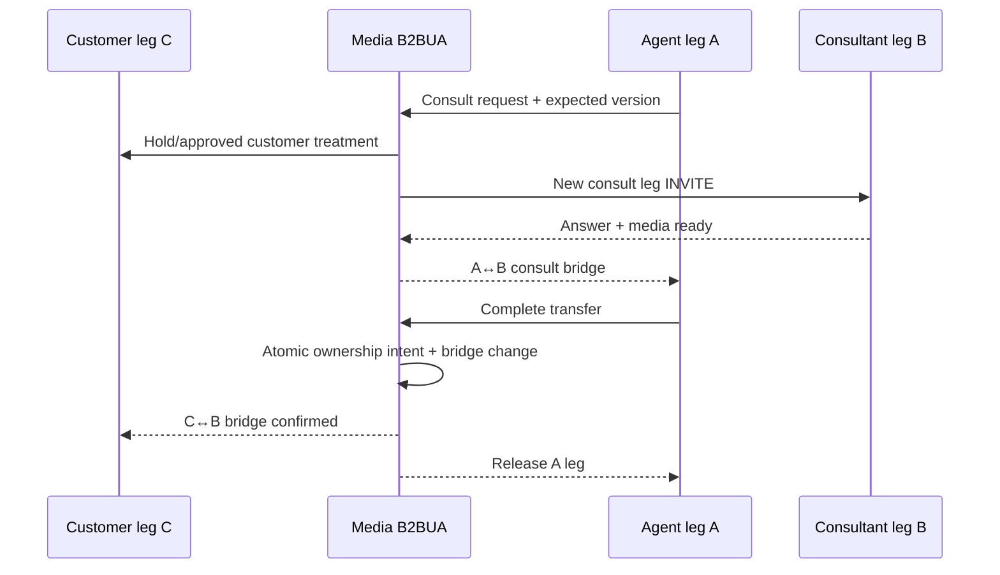

# Worked voice scenarios: legs, ownership and recovery

Notation: `I` interaction, `C` customer leg, `A` agent leg, `B` consult/transfer target, `S` supervisor leg, `F` conference focus, `R` recording. SIP dialogs and media UUIDs are distinct from these platform ids. The reference topology keeps C anchored on a B2BUA/media node; see [leg ownership](../architecture/call-leg-ownership.md). All operations carry command id, expected leg/interaction version, actor and policy version.

## 1. Inbound IVR → skills/proficiency routing → agent

| Step | Legs / bridge | Authoritative event and owner | Failure path |
|---|---|---|---|
| Carrier INVITE admitted | C created; no A | SBC trust/admission; B2BUA dialog; interaction I assigned | reject/reroute before answer within attempt budget |
| IVR greets and collects | C ↔ prompt engine | IVR pins flow version; DTMF/ASR input with confidence | timeout, repeat limit, accessible fallback |
| Route by skill | C ↔ queue audio | queue episode Q; router excludes unqualified agents and ranks eligible ones | no match → approved overflow/callback, not silent skill relaxation |
| Reserve/offer | C still parked; A alerting | offer authority commits fence; gateway delivers; media creates A | expired/failed offer releases fence, next attempt |
| Agent accepts | C and A distinct; bridge pending | gateway ack then media connected event | SIP answer without RTP is not handled |
| Bridge and record | C ↔ media ↔ A; R fork | media reports bridge/quality; recording manifest segments | one-way RTP/mandatory recorder failure invokes policy |
| End/wrap-up | C/A end independently | interaction terminal; agent occupancy → wrap-up; recording finalizes | duplicate/lost events reconcile by versions |

**Invariants:** one active reservation per voice capacity; skill threshold and tenant boundary never softened by score; C is not handed to A before answer/bridge; Q wait and AHT clocks use explicit event definitions. A late A answer after fence expiry is rejected or safely terminated. Capture `I,Q,attempt,fence,C,A,media_uuid,recording_id` in one timeline.

## 2. Hold, resume, mute and DTMF

Agent presses **hold**: gateway checks that A is connected to I; B2BUA applies hold treatment to the appropriate media leg via SDP re-offer or platform bridge policy, optionally playing approved music/prompt to C. State becomes held only on media/signaling acknowledgment. Recording policy decides whether customer, agent and MOH tracks continue. An SDP re-INVITE failure leaves the previous bridge state authoritative, with UI error and diagnostic evidence. **Resume** renegotiates/restores audio and confirms RTP separately. **Mute** may disable the agent's local sender track without holding C; it must not be reported as a hold or as a recorder pause. **DTMF** traverses the configured method (RTP telephone-event, SIP INFO or in-band as interop dictates); validate the far-end reception and avoid leaking sensitive digits to logs/recordings.

## 3. Blind transfer (platform-orchestrated)

1. Agent A requests transfer to destination B with idempotency key. Check destination permissions, number route, recording/consent, outbound fraud and interaction state. Freeze conflicting commands with version/fence.
2. Keep C anchored, on policy-defined hold/queue audio. Create target leg B and mark `transfer_pending`; do **not** end C or count transfer complete on API acceptance.
3. On target answer and media readiness, bridge C ↔ B. Record new participant/assignment or external destination, routing outcome and recording topology. Release A after B is confirmed; end A leg. Preserve the same I across the transfer, with a new queue episode if transferred to a queue.
4. If B rejects, times out or media fails, release B; restore C ↔ A if A remains, or send C to a declared recovery queue/IVR. Reconcile ambiguous target outcomes before retry to avoid double dialing.

For endpoint-managed REFER, the refer event and subsequent NOTIFY/target dialog must be correlated; a 202 to REFER is not evidence of a completed transfer. Whether the platform can keep C anchored and recorded is an explicit interop decision. [RFC 5589](https://www.rfc-editor.org/rfc/rfc5589.html) describes SIP transfer examples; this reference design chooses platform control for audit and continuity.

## 4. Attended transfer / consult

A consult is **not** a customer transfer: while A speaks with B, C stays on hold and I remains assigned to A. Completing transfer requires B still connected and the C↔B bridge acknowledged; assignment moves to B/external destination, A enters wrap-up according to policy, and R segments/consent are updated. Cancel consult releases B and restores C↔A. If A disconnects during consult, policy decides whether B can accept C or C returns to queue; never infer completion from A's lost WebSocket. SIP Replaces may be used in an interop-specific implementation ([RFC 3891](https://www.rfc-editor.org/rfc/rfc3891.html)); validate dialog/tag mapping and recording continuation.

## 5. Three-party conference and participant churn

A requests conference with B while C remains anchored. Media allocates focus/mixer F, verifies per-leg codec/transcoding capacity and creates/joins C, A and B as distinct participants. Join is not complete until each leg's media reaches the mix. The participant graph records role, joined/left times, mute/hold, consent and leg id. Recorder policy decides mixed vs separate tracks and whether each participant must hear an announcement. When B leaves, F continues C↔A; when A leaves, policy decides whether C↔B may continue or must end; when C leaves, the customer interaction can terminate even if A/B consult continues under a separate session. Focus/node loss generally ends all mixed legs; failover to a new focus is not assumed. Conference focus behavior is covered by [RFC 4579](https://www.rfc-editor.org/rfc/rfc4579.html).

## 6. Supervisor monitor, whisper and barge

Supervisor request is authenticated, purpose-scoped, authorized for tenant/queue and evaluated against monitoring/consent policy. Media creates S, not a hidden UI-only flag. **Monitor:** S hears permitted mix without transmitting to customer/agent. **Whisper:** S transmits only to A. **Barge:** S joins the customer-agent mix, requiring a new participant policy/recording evaluation. Each transition needs executor ACK, audit, indicator policy and teardown. A supervisor losing authorization mid-session triggers revocation. Stale interaction/leg versions cannot attach S to a different customer's reused endpoint.

## 7. Queue transfer, overflow and callback

Queue-to-queue transfer closes Q1 with transfer reason and opens Q2 under the same I; it may change skill/proficiency requirements, SLA clocks and routing policy version according to a documented rule. Old reservation and A leg release only after ownership transition is durable, so no simultaneous offers. Overflow to another site/region verifies capacity, geography and data/recording obligations. Callback promise is a separate scheduled interaction linked to I; confirm consent/window and dedupe attempts. Customer disconnect while waiting finalizes Q with abandonment reason; a scheduled callback is not counted connected until both legs and media bridge succeed.

## 8. Partial-failure examples

| Fault | Preserve | Stop/reconcile | Evidence |
|---|---|---|---|
| Router dies after reserve | C queue/IVR leg | lease sweep or same-attempt replay; no second A assignment | fence, attempt ledger, Q age |
| A answers after offer expiry | C remains parked | reject stale accept and terminate orphan A leg | gateway seq, fence, SIP/dialog trace |
| C hangs up during consult | A↔B consult may end by policy | cancel pending transfer, release queue/recording state | C BYE, bridge/assignment events |
| B answers but bridge command response lost | C remains safely anchored | query media bridge/target leg before retry | media UUID, command id, RTP observations |
| A endpoint drops during conference | C/B may remain per policy | remove A participant, agent occupancy reconciliation | ICE/SIP/RTP, focus participant graph |
| Recording segment missing after transfer | live media may continue only per policy | mark R partial, investigate gap and consent boundary | sequence/checksum/segment times |

These scenarios must be exercised with SIP ladders, SDP changes, RTP/recording evidence and event timelines. A successful UI button response or API status alone is insufficient.
