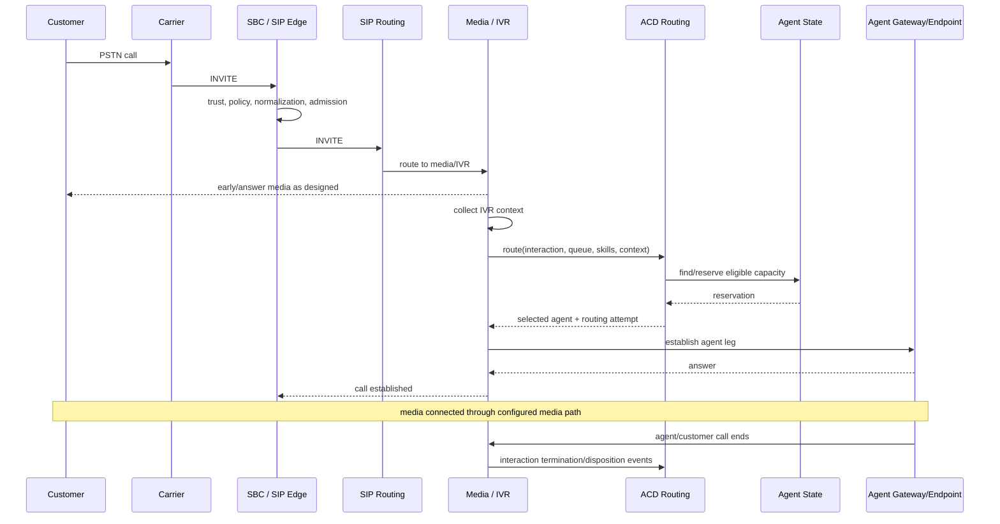

# Inbound Voice — End-to-End Call Flow

## Phase 1 — Admission

Carrier ingress should be authenticated/trusted according to the carrier model, normalized as needed, rate/admission controlled, and correlated with a platform interaction identifier as early as practical.

## Phase 2 — IVR

The media/application tier owns prompt/media behavior and gathers routing context. External service calls should not have unbounded latency. The IVR needs defined fallback behavior when CRM, identity or other dependencies fail.

## Phase 3 — Routing

The routing request should contain sufficient context to make a deterministic policy decision: tenant/business unit, queue, skills, priority, language, customer context, channel, and other approved attributes.

The routing system must reserve—not merely observe—agent capacity before delivery.

## Phase 4 — Agent delivery

Agent delivery can create a separate SIP/WebRTC/media leg. The platform should distinguish `reserved`, `offered`, `ringing`, `accepted`, `connected`, `failed`, and `timed-out` states so recovery behavior is explicit.

## Phase 5 — Connected interaction

Routing-worker availability should not be required to keep an already established media session alive. This separation reduces the blast radius of control-plane failure.

## Phase 6 — Termination

Call teardown should generate idempotent finalization events for agent state, queue/routing state, interaction history, recording metadata, analytics and downstream consumers.

## Correlation requirement

Every phase should preserve `interaction_id` even when SIP Call-IDs or media UUIDs change across B2BUA boundaries. This is the foundation for end-to-end troubleshooting.
