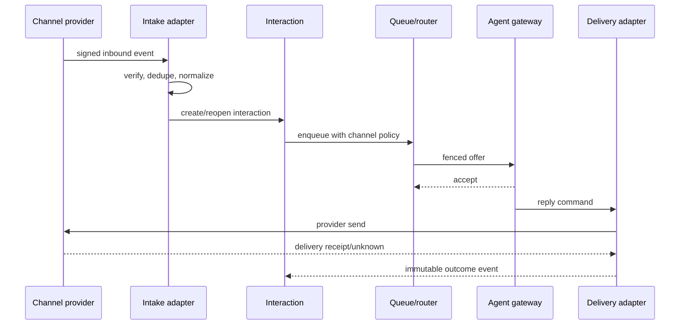

# End-to-end flows beyond inbound voice

These sequences are reference contracts. Every arrow needs a timeout, authentication, correlation id and owner; user-visible states must reflect acknowledgments, not optimistic button clicks.

## Digital conversation

Provider ACK does not imply customer delivery. If the reply command times out after provider acceptance, reconcile by provider id/idempotency key before retry. The queue lease prevents two agents replying simultaneously.

## Callback

Customer consent/request → callback promise + window → scheduled admission → agent capacity reservation (policy order may differ) → customer dial → agent dial/bridge → connected or bounded retry → final promise status. On missed window or exhausted attempts, notify through permitted channel and retain the failure reason. Do not count a scheduled callback as completed merely because dialing began.

## Supervisor intervention

Supervisor authenticated request with reason → policy/RBAC + consent evaluation → authoritative media leg lookup → media command → media acknowledgment → audit and timeline → supervisor UI confirmation. If media command outcome is unknown, query leg state before retry. Recording indicator and monitor session are distinct; neither should be inferred from a UI toggle.

## Transfer and consult

Agent requests consult → preserve customer leg and create consultant leg → consultant answers → agent completes attended transfer or cancels → interaction/assignment ownership moves under one versioned transition → old leg tears down. Blind transfer still needs a tracked destination outcome and recovery on failure. Report queue episodes, agent intervals and recording segments across all legs; SIP Call-ID alone is not the interaction identity.

## Partial failure boundaries

- Event bus unavailable after a call ends: media terminates independently; durable outcome/outbox must reconcile before a complete history claim.
- Agent accepted but media failed: reservation is released or requeued under an explicit attempt; do not mark handled.
- Transcription fails: call/recording can be complete, transcript is failed with retry/DLQ.
- Reporting projection lags: supervisor displays watermark; routing never waits on it.
