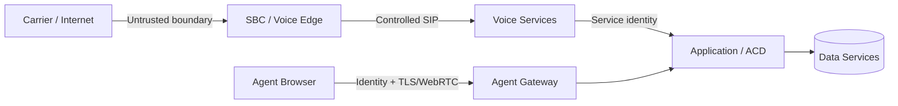

# Security & Compliance Boundaries

## Principle

Security requirements should be attached to data flows and trust boundaries, not added as a generic box around the architecture.

## Primary trust boundaries

### Carrier edge

Controls can include source validation, SIP normalization, malformed-message handling, rate limiting, admission control, topology hiding, encryption where supported, and explicit carrier routing policy.

### Agent access

Agent identity is separate from SIP identity. Browser/API access should use strong application authentication and authorization, short-lived credentials where practical, session controls, and least-privilege APIs. WebRTC introduces DTLS-SRTP/ICE-related controls distinct from traditional carrier SIP.

### Service-to-service

Internal does not mean trusted by default. Service identity, authorization, network policy, secret management, encryption requirements and auditability should be explicit for control-plane APIs.

## Data classification

Before choosing retention or encryption controls, classify data such as recordings, transcripts, phone numbers, customer identifiers, authentication data, payment-related data, health-related data, routing metadata, logs and packet captures.

Packet captures deserve special treatment because they can unintentionally contain signaling identifiers, credentials in insecure deployments, network topology, SDP addresses and potentially reconstructable media.

## PCI-oriented architecture consideration

Where payment-card data is handled, a key architectural objective is minimizing the systems that enter the cardholder-data environment. Designs may isolate payment collection or suppress recording/agent exposure during sensitive entry. Exact PCI DSS applicability and controls depend on implementation and must be validated against current requirements and organizational compliance guidance.

## HIPAA-oriented architecture consideration

Where protected health information is processed, architecture must consider access control, auditability, transmission/storage protection, minimum-necessary exposure, retention, vendor/business-associate relationships and operational procedures. Technology choices alone do not make a platform HIPAA compliant.

## Secrets

Do not place carrier credentials, SIP passwords, API keys, TLS private keys or production tokens in repositories or static container images. Use an appropriate secret-management mechanism and rotation process.

## Abuse cases

Voice platforms should explicitly model toll fraud, credential stuffing, SIP scanning, call pumping, denial-of-service/CPS floods, unauthorized recording access, API abuse and privilege escalation in agent/supervisor functions.

## Audit

Administrative changes to routing policy, queues, skills, agent permissions, recording policy, carrier configuration and security settings should generate attributable audit events with appropriate retention and tamper resistance.

## Repository rule

Examples in this repository are architectural. They must not be interpreted as a certification statement or as a complete PCI DSS, HIPAA, privacy, or regulatory control set.
